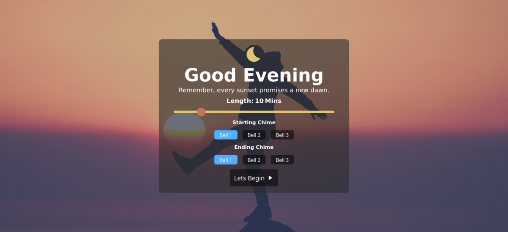

# ZenTimer: Your Online Meditation Companion



## Description 
Discover tranquility with ZenTimer, a web-based meditation timer designed to aid your meditation practice.

## Demo 
Live Demo: [Demo](https://github.com/cr-booker/zen-meditation-timer)

## Getting Started 
1. Clone this project  
   ```
   https://github.com/cr-booker/zen-meditation-timer.git
   ```

1. Ok with the project cloned lets cd into the directory:  
   ```
   cd zen-meditation-timer
   ```

1. Now we install our dependcies for the project
   ```
   npm install
   ```
## Usage 
### Start dev server: 
   ```
   npm run dev
   ```
### Building a distribution version:   
   ```
   npm run build
   ```
### Locally preview production build 
   ```
   npm run preview
   ```
   This will ceate a distribution version of the project inside your local dist/ folder

## Built With 
HTML  
CSS  
React  
Vite  
Love

## License
This project is made available under the GNU General Public License v3 (GPLv3)  
Click [here](https://github.com/cr-booker/zen-meditation-timer/blob/main/LICENSE) for more details.
